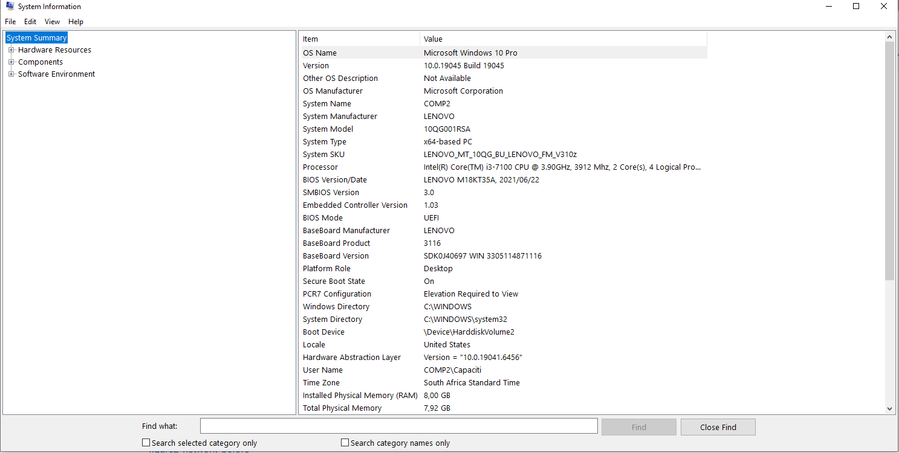
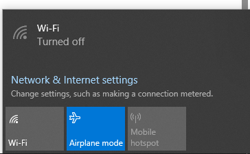
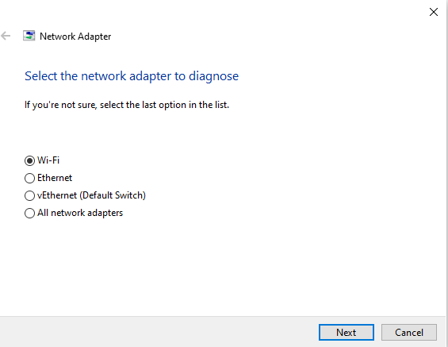
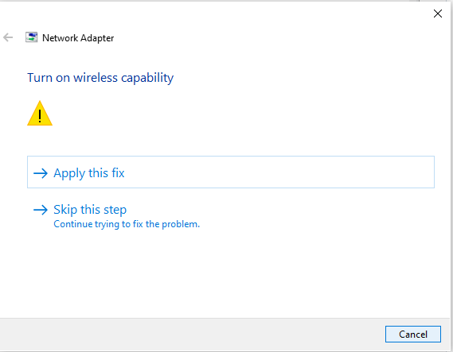
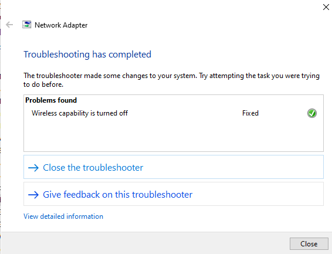
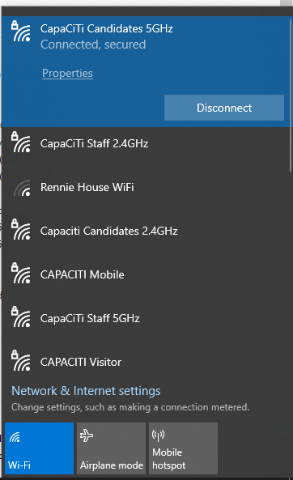

# IT Support Fundamentals: System Audit & Troubleshooting Report

##  Project Overview
This repository contains the documentation for my first practical assignment in the **Google IT Support Professional Certificate**.  
The task involved performing a system check, verifying network connectivity, and resolving a simulated technical issue using logical troubleshooting steps.

---

## 💻 System Specifications
I used the Windows System Information tool (`msinfo32`) to audit the hardware and software environment.

| Component | Specification |
|----------|---------------|
| **Operating System** | Microsoft Windows 10 Pro |
| **System Manufacturer** | LENOVO |
| **System Model** | 10QG001RSA (All-in-One) |
| **Processor** | Intel(R) Core(TM) i3-7100 CPU @ 3.90GHz |
| **Installed RAM** | 8.00 GB |
| **BIOS Mode** | UEFI |

---

##  Step 1: Network Verification
To establish a baseline, I verified the network status using the Command Prompt.

- **Command Used:** `ping google.com`  
- **Observation:** The system successfully communicated with the Google DNS, showing 0% packet loss and normal latency. This confirmed the network stack was initially functional.

---

## 🛠️ Step 2: The Troubleshooting Process
Following the IT support methodology learned in Course 1, I documented the resolution of a connectivity failure.

### 1. Identifying the Problem
The user reported no internet access. Initial inspection showed that **Airplane Mode** was turned ON and the **Wi-Fi adapter** was disabled.

### 2. Formulating and Testing a Theory
I theorized that the software-level toggle was preventing the wireless adapter from working.  
I ran the Windows Network Diagnostics tool.

- **Diagnostic Result:** “Wireless capability is turned off.”

### 3. Resolution (The Fix)
I used the automated **Apply Fix** option in the Windows Troubleshooter and manually turned **Airplane Mode OFF** to re-enable the Wi-Fi adapter.

### 4. Final Verification
I ran another network test and confirmed the system successfully connected to the network again.

---

##  Evidence Gallery
Below are the documented steps taken during the process.

### System Audit
  
*Audit of the Lenovo All-in-One hardware specifications.*

### Problem Diagnosis
  
*Identifying that Airplane mode is active and Wi-Fi is disabled.*

### Applying the Fix
  
  
  
  
  
*Using Windows Network Diagnostics to restore wireless connectivity.*

### Successful Resolution
  
*Final verification showing a successful connection and active network status.*

---

##  Conclusion
This task demonstrates the ability to:
- Perform a basic system audit  
- Verify network connectivity using built-in tools  
- Apply structured troubleshooting steps  
- Resolve a common connectivity issue  
- Document the process clearly with evidence  

This reflects core IT support skills such as problem isolation, logical diagnosis, and solution verification.
